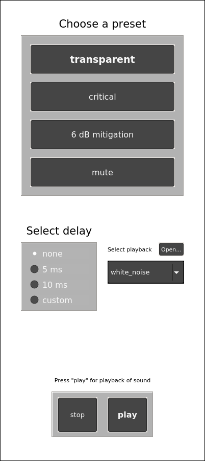

# Comb filter comparison Octave GUI
This Octave GUI can be used to manipulate the gain table of the mobile hearing aid prototype and adjust the latency to investigate the effects of comb filtering. Playback of different sounds, including white noise and music, can be used to listen for these effects.

To find out more about the topic of comb filter effects with the mobile hearing aid prototype, check out [1].

## Usage

### The GUI

### Presets
To manipulate the gain table of the prototype you can select between four different presets.
#### transparent
This is the default operation mode of the prototype. The input signal is adjusted in such a way that it mimics the sound perception as if you are listening without earphones. In a sense this could be described by transparent listening. The gain is set to 0 for all center frequencies (177, 297, 500, 841, 1414, 2378, 4000, 6727, and 11314 Hz).
#### critical
With this preset, the input signal is attenuated by the attenuation values of the earphones, as obtained by a psychoacoustical amplitude-phase measurement [1]. This is done at the 9 center frequencies of the prototype. This should result in the strongest comb filter effects, since the attenuated direct sound and the processed sound have the same amplitude - level difference of 0 dB between both signals.
#### 6 dB mitigation
To mitigate possible comb filter effects, the level difference between the attenuated direct sound and processed can be increased to a level difference of ± 6 dB. This will in turn reduce the destructive gain of the comb filter by roughly 6 dB.
#### mute
The last preset is to simply turn off the processed sound completely. In this case only the attenuated direct sound will be audible - no comb filter effects will occur.

### Additional delay
The internal latency of the prototype is around 3.7 ms. This delay plays a major role in the varying effects of the comb filter. With zero delay or latency, which is almost impossible, the attenuated direct sound and processed sound would only interfere constructively - their amplitudes simply add up. This would result in a total gain of 6 dB. With increasing delay, more destructive interference is created until both sounds can be perceived as two distinct events. Hence, the overall comb filter effects should increase with higher latencies.

This effect can be investigated by switching between no additional delay, a total delay of 5 ms, 10 ms, or even setting a custom variable delay between 3.7 and 20 ms. By clicking the "custom" radio button, a slider will appear below to choose from.

### Playback
To actually test the settings and listen for comb filter effects, playback of, e.g., white noise or music, can be used. Different playback sounds can be selected through the drop-down list below "Select playback". You can also add your own samples by clicking on "Open..." and selecting any .wav file. Make sure, that the files are located in the same folder as the GUI script. Simply copy your desired sound files into the folder.

The playback can be started and stopped by the controls on the bottom of the GUI. When a new sound is selected via the drop-down list, the playback of the current sound will be stopped automatically. You will need to click "play" for playback of the new selection to start.

Note: The sound files "white_noise", "classical_music", and "pop_music" are only 10 seconds in duration. Playback has to be started again after it has stopped. You can of course add sound files which are longer than 10 seconds.

## References
[1] Jacobsen, Simon (2019) Mitigation of comb filter effects by in-situ amplitude-phase measurements and gain table manipulation with a mobile hearing aid prototype. Bachelor thesis, Carl von Ossietzky University Oldenburg. https://oops.uni-oldenburg.de/id/eprint/4591
